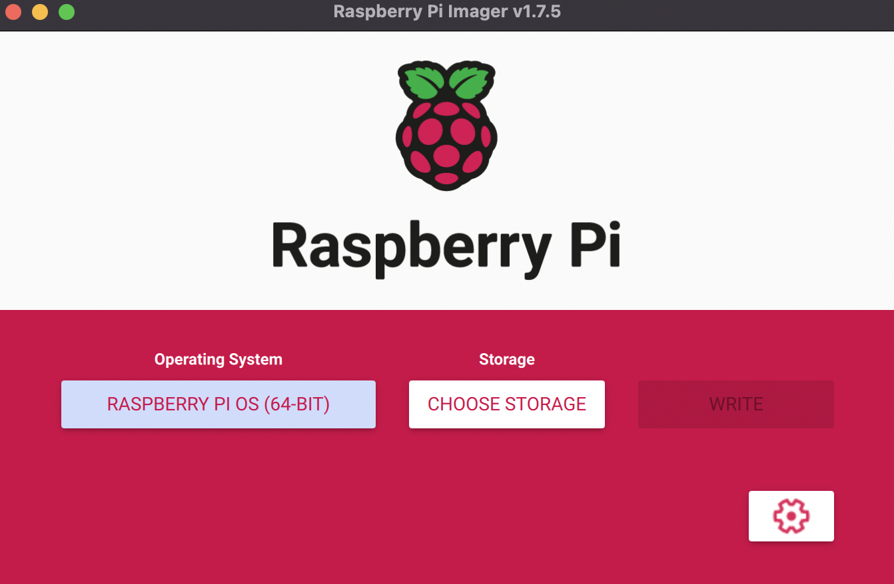

# Physical Set-Up of the Raspberry Pi Cluster

Hardware intros and connection goes here.

# Flashing the Raspberry Pi OS and Enable SSH

First of all, we flash the operating system to the SD cards. It is recommended to install Raspberry Pi OS(previously called Raspbian) with [Raspberry Pi Imager](https://www.raspberrypi.com/software/), it comes with advanced options to directly configure SSH and network settings, ect. It is also possible to use other utilities to flash the image such as [balenaEtcher](https://etcher.balena.io/). In this tutorial, we use Raspberry Pi Imager to flash Raspberry Pi OS (64-bit). After selecting the OS and storage, open advanced settings on the lower right corner, and set for the following: 



1. Set hostname as rpi0, rpi1, rpi2, and rpi3 for each of the four RPis.
2. Enable SSH - Use password authentication.
3. Set username and password, the default setting is 'pi' and 'raspberry'.
4. Set locale settings.

# Network Configuration

In this step, we share Wifi connection to the RPis through an Ethernet cable. For detailed instructions on how to do this, see [Linux](https://www.tecmint.com/share-internet-in-linux/), [Mac](https://medium.com/@tzhenghao/how-to-ssh-into-your-raspberry-pi-with-a-mac-and-ethernet-cable-636a197d055). In the terminal, type in `ifconfig`, look for the `inet` field and write it down. In my case, it's 192.168.3.1. 

# Set up Static IP Address

|   Node        |    Hostname   | IP Address     |
| ------------- |:-------------:| :-------------:|
| master        | rpi0          | 192.168.3.250  |
| slave         | rpi1          | 192.168.3.251  |
| slave         | rpi2          | 192.168.3.252  |
| slave         | rpi3          | 192.168.3.253  |

Power the RPis up, connect the Ethernet cable, and enable network sharing on your machine. We connect to each RPi and do the following in the terminal in turn:

1. `ssh [username]@[hostname].local`
2. Type in `yes` and the password.
3. `sudo nano /etc/dhcpcd.conf`
4. Scroll down untill you see '# Example static IP configuration :' section, and replace the content with
   ```
      interface eth0
      static ip_address=192.168.3.xxx/24
      static routers=192.168.3.1
      static domain_name_servers=192.168.3.1 8.8.8.8
   ```
   The "xxx" stands for the last three digits of the static IP address, which can be found in the table above.
5. Click Ctrl+O followed by Ctrl+X to save the changes and exit.
6. `sudo reboot`
7. Try ssh using the configured static ip address with `ssh [username]@[ip address]`